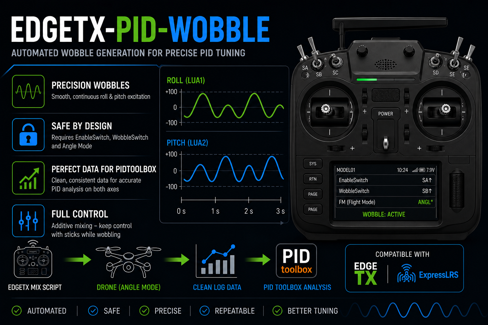

# edgetx-pid-wobble



An EdgeTX Lua mix script that generates continuous, time-interleaved wobbles on roll and pitch — producing high-quality stick input for PID tuning with the PIDtoolbox.

[](LICENSE)
[](https://edgetx.org)
[](https://www.expresslrs.org)
[](../../issues)
[](../../commits/main)

---

## 📚 Table of Contents

- [📋 Compatibility](#-compatibility)
- [🎯 What is it for?](#-what-is-it-for)
- [🧰 Requirements](#-requirements)
- [📥 Installation](#-installation)
- [🛠️ Troubleshooting](#-troubleshooting)
- [💡 Credits](#-credits)
- [🤝 Contributing](#-contributing)
- [⚠️ Disclaimer](#-disclaimer)
- [📄 License](#-license)

---

## 📋 Compatibility

| Component   | Minimum Version | Tested On | Test Hardware                              |
|-------------|-----------------|-----------|--------------------------------------------|
| EdgeTX      | v2.10           | v2.12.0   | Radiomaster TX15, Radiomaster TX16S MK3    |
| ExpressLRS  | v3.0.0          | v4.0.0    | Radiomaster RP1 V2, RP3 V2, RP4TD          |

The script is implemented as a **Mixer Script** and therefore only runs on EdgeTX radios with sufficient flash/RAM — in practice, **only color-display radios**. Radios without a Mixer Scripts entry in the model menu are **not supported**.

---

## 🎯 What is it for?

Tuning a flight controller with the PIDtoolbox requires clean, repeatable stick excitations on both axes. Doing this by hand produces inconsistent input — the analysis becomes noisy, the result less reliable.

`wobble.lua` solves that by generating a deterministic excitation pattern in the radio itself:

- **Continuous cycle** that loops seamlessly as long as the wobble is active.
- **Roll and pitch run simultaneously but time-interleaved** — each axis has quiet windows where the other carries the excitation — so PIDtoolbox sees clean data on both axes.
- **Additive mixing** with the existing stick input: the pilot can override the wobble at any moment by moving the sticks.
- **Amplitude control** *(optional)*: a free-to-assign poti or switch scales the wobble strength by ±50% during the flight.
- **Auto-pause on stick override:** when the pilot moves the roll or pitch stick beyond ~20%, the wobble pauses automatically so manual corrections aren't disturbed, and resumes once both sticks return to center.
- **Two-stage safety interlock:** the wobble can only start when both an explicit *enable* switch (edge-triggered, no auto-release at boot) **and** an *activation* switch are set, **and** the flight controller reports Angle mode via telemetry.

---

## 🧰 Requirements

- A radio running EdgeTX 2.10 or newer (color-display models only)
  > The `v2.10` minimum is the earliest version verified on hardware. The script likely runs on older 2.x builds too, but those are untested — reports welcome.
- An ExpressLRS receiver running firmware 3.0 or newer with telemetry enabled
  > The `v3.0.0` minimum is the earliest version verified on hardware. The script likely runs on older 2.x builds too, but those are untested — reports welcome.
- A flight controller that exposes its flight mode via CRSF telemetry. Supported out of the box:
  - **Betaflight** / **INAV** in `ANGL` mode (Angle / Self-level)
  - **ArduPilot Copter** in `STAB` mode (Stabilize)
- The text sensor `FM` must be discovered on the radio (it appears automatically after a telemetry discovery)

---

## 📥 Installation

### 1. Copy the file to the SD card

Take the SD card out of the radio (or connect the radio via USB as mass storage) and place `wobble.lua` here:

```
SCRIPTS/
└── MIXES/
    └── wobble.lua
```

### 2. Discover the `FM` telemetry sensor

The script refuses to run unless it can read the current flight mode. Without the `FM` sensor it stays silent — there is no error message.

1. Power up the radio with the model bound and the flight controller fully booted (telemetry must be live).
2. **Model Settings → Telemetry → Discover new sensors**.
3. Confirm that the entry **`FM`** (text sensor) appears in the sensor list.

### 3. Register the script as a Mixer Script

1. **Model Settings → Mixer Scripts**.
2. Pick a free slot and select `wobble`.
3. Map the inputs to the switches you want to use:
   - **Enable** — your release switch (edge-triggered: must be flipped OFF→ON **after** boot to grant release)
   - **Wobble** — your activation switch (level-triggered: wobble runs while up, stops the moment it goes down)
   - **AmpScale** *(optional)* — a poti or switch to scale the wobble amplitude live: at −100% the wobble runs at 50% strength, at +100% at 150%. Centered or unassigned → 100% (unchanged).
4. Save.

> **About switch positions for Enable and Wobble:** A source value `> 0` is treated as ON, `≤ 0` as OFF. On a 3-position switch, only the **upper** position counts as ON — the middle position is OFF, so an accidental nudge into mid won't release or activate the wobble.

### 4. Wire the Mix outputs into Roll and Pitch

1. Open **Model Settings → Mixes**.
2. Click the **Roll / Ail** channel and choose **Insert after** to add a new line below the existing stick mix.
3. Under **Source**, switch to the **Lua Scripts** tab and select `1-wobble/Roll`.
> The source names follow the EdgeTX convention `<slot>-<filename>/<output>`. The leading `1-` is the Mixer-Scripts slot the script occupies (LUA1 = slot 1) and is set automatically by EdgeTX. If you place `wobble` in a different slot (e.g. LUA2), the sources become `2-wobble/Roll` and `2-wobble/Pitch` accordingly.
4. Leave all other settings at their defaults.
> **Optional:** Assign your `EnableSwitch` source to each mixer line's **Switch** field — this gates the line at the mixer level, independent of the script's own interlocks.
5. Go back to the Mixer overview and repeat steps 2–4 for the **Pitch / Ele** channel — this time picking `1-wobble/Pitch` as the source.

### 5. Test it on the bench

1. Power up the model with the receiver bound and the FC in Angle mode.
2. Confirm that the wobble does **not** start while the Enable switch is still down at boot.
3. Flip Enable from OFF→ON, then move the Wobble switch to ON. The roll and pitch outputs should start their sweep — visible on the radio's channel monitor.
4. Confirm that the wobble stops immediately as soon as **any** activation condition is no longer met — i.e. flip the Wobble switch off, the Enable switch off, or switch the FC out of Angle mode. The roll and pitch outputs must jump back to `0` in the same tick, with no fade or held last value.

---

## 🛠️ Troubleshooting

- **Script doesn't show up under Mixer Scripts:** Check the file name — it must be exactly `wobble.lua` (max. 6 characters before `.lua`, otherwise EdgeTX hides mixer scripts).
- **Wobble never starts, even with both switches up:** Verify that the `FM` sensor exists in the model's telemetry list and currently shows a valid string (e.g. `ANGL` or `STAB`). Without it the safety interlock blocks the wobble.
- **Wobble doesn't start after boot although Enable is up:** That's by design — the Enable switch is edge-triggered. Flip it OFF→ON once after boot to grant release.
- **Roll or pitch don't respond to the sticks at all:** The mixer multiplex on the wobble line is set to `Replace` instead of `Add` (the EdgeTX default). With `Replace`, the script's output completely overrides the stick input.

---

## 💡 Credits

The idea for this script comes from the PIDtoolbox YouTube video ["An 'Auto Wobble' Controller from your open/edgeTX radio"](https://www.youtube.com/watch?v=NczSDkKn9pY), which explains the manual wobble procedure for PID analysis.

---

## 🤝 Contributing

Found a bug, have an idea for an improvement, or running an FC firmware whose flight-mode strings aren't covered yet? Please [open an issue](../../issues) on GitHub. Pull requests are welcome too.

---

## ⚠️ Disclaimer

This script is provided **as is** and is intended as a tuning aid only. It actively injects stick input into the roll and pitch channels and must therefore only be enabled in a controlled environment — at safe altitude, away from people and obstacles, with the pilot ready to take over via the sticks at any moment. The built-in safety interlocks (Enable switch, activation switch, Angle-mode telemetry check) reduce the risk of accidental triggering, but they do **not** replace careful flying within visual range, your own judgement, or the safety mechanisms of your transmitter, receiver and flight controller. Use at your own risk.

---

## 📄 License

Released under the [MIT License](LICENSE).
